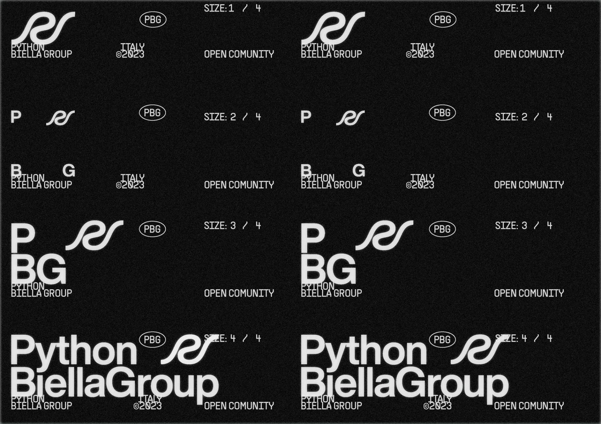

# Our new brand identity

It's hard not to notice the radical change we've made to our image and communication in recent weeks.

In collaboration with [Gradient](https://www.hypergradient.it/), we've worked hard to develop a new digital identity and fresh iconography.

Renewing our identity has been a challenge, especially for a dynamic community like ours, but it was a necessary step to improve the quality of our educational service and make it more inclusive.

In our new design, [Gradient](https://www.hypergradient.it/) drew inspiration from the [zen of Python](https://pythonitalia.github.io/python-abc/Pyllole/99_Zen.html), the beating heart of this language.

Here's what we've done:

* We've opted for a black and white color palette to promote simplicity and accessibility.

* We exclusively use the Helvetica font for all text, as it's an open-source font accessible to everyone.

* Our iconography has been simplified and made clear, direct, and without frills - just how we like to be and operate.

* At the same time, we've aimed to be bold and modern.

Saying goodbye to the little bear that has accompanied us for the past 3 years was difficult, but we felt it was time for a change!

We hope you appreciate our new look as much as we do.