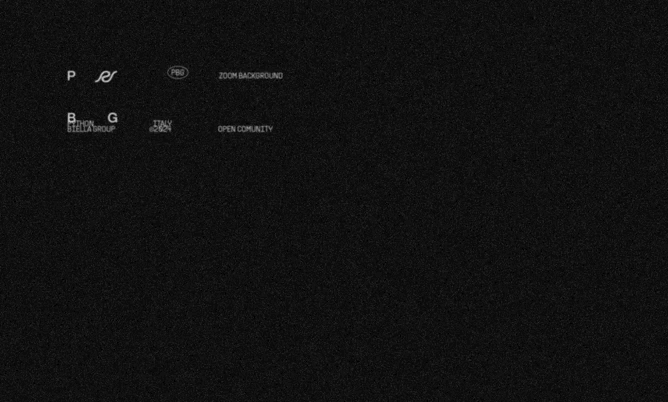

# Brand identity

At the heart of our community, the redesign presents itself not only as a visual metamorphosis but as a true manifesto of principles, where form meets function in an aesthetic embrace that celebrates clarity, precision, and openness. The new logo, bold in its simplicity, stands as a beacon of recognition, exuding a sober confidence in black and white that recalls the purity of intent and commitment to accessibility.

This renewed digital identity, forged in alliance with [Gradient](https://www.hypergradient.it/), draws deep inspiration from the [zen of Python](https://pythonitalia.github.io/python-abc/Pyllole/99_Zen.html), reflecting the very essence of the language in its minimalist elegance. The deliberate choice of a color palette restricted to black and white only, along with the exclusive adoption of the Helvetica font, is not just a tribute to functionality but an invitation to communion in the sign of accessibility and inclusion. The iconography, purified of any superfluity, speaks a language that is direct and essential, aiming to transcend visual simplicity to touch the true essence of communication.

The transition from the beloved bear symbol of our previous phase to this new expression of our being marks not only an aesthetic change but the transition to a new era of maturity and boldness. This evolution does not represent a break with the past but rather growth, an enrichment that, while respecting our roots, looks with new and courageous eyes towards the horizon of possibility.

We invite every member and observer to immerse themselves in this new dimension of PythonBiellaGroup, to be guided by the clean lines and defined contrasts of our new visual world, where every element is a bridge to knowledge, openness, and sharing. It is an open invitation to participate, to explore, and, above all, to grow with us in this adventure that, more than ever, celebrates the intrinsic beauty in simplicity, elegance, and community.
