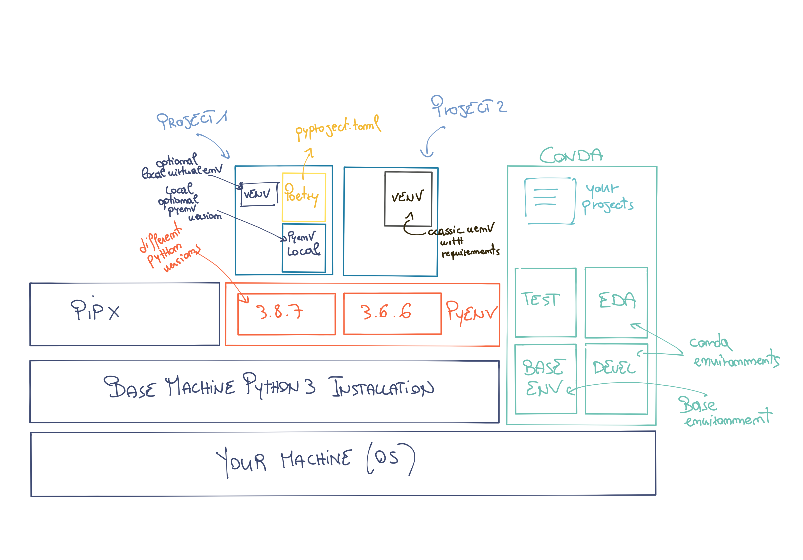

# Managing multiple Python versions
In this first section, we will explore how to manage your Python installations on your machine using **pyenv**.




---
## **Pyenv**

### Overview

Pyenv allows you to manage multiple Python versions installed on your machine, making it simple and fast to switch between them.

It is straightforward and not too intrusive, and you can use it on any operating system.

* It allows you to change the global Python version or set a local one for each project or user.
* You can manage a local Python version for each project with its specific Python version.
* It allows you to override the Python version as environment variables (no need to manage them manually).
* You can search for different Python versions and manage them (with tox).

### Some Very Important Aspects

* No bootstrap problems; it is built using pure shell scripts.
* You don't need to load it into your shell; just add its directory to your environment variables, and it works "on its own."
* It also allows you to manage virtual environments more efficiently.
* [Well-documented](https://github.com/pyenv/pyenv) with extensive online support.

### Useful Commands

```
pyenv install --list

# Install a specific Python version
pyenv install 3.7.4

# Display all installed versions (by pyenv)
pyenv versions

# Set a specific Python version globally (used by the entire operating system)
pyenv global 3.7.4

# Set a local Python version
pyenv local 3.7.4 #creates a .python-version file
# Deleting the .python-version file removes the local version
rm .python-version

# Change the version only for the existing shell session
pyenv shell system
```

With pyenv, we have solved the problem of quickly and effectively changing the Python version installed on your machine.

The problem of managing dependencies (libraries) within different projects still remains.

Python has a significant issue: you cannot have multiple versions of the same library (package) installed in a specific Python version.

This is where **virtual environments** come into play.

It is important to use separate virtual environments for each Python project, starting with the simpler ones.

---

## **Advanced Pyenv**

In this advanced section, you will find notes, best practices, and guides to delve deeper into Pyenv.

### Useful Documentation

https://realpython.com/intro-to-pyenv/

Pyenv with Poetry

https://blog.jayway.com/2019/12/28/pyenv-poetry-saviours-in-the-python-chaos/

Guide to configuring pyenv on Mac

https://opensource.com/article/20/4/pyenv

Notes on a GitHub Gist

https://gist.github.com/Geoyi/f55ed54d24cc9ff1c14bd95fac21c042

Pyenv is a Python installation manager. It allows you to install and run multiple Python installations on the same machine.
Pyenv manages different Python versions for you, avoiding the chaos of dependencies, versions, and installations illustrated in the initial image.

**Why not use the default Python installed on your operating system?**

Because it can create problems in projects; each project may have its Python version, and there can be migration and reproducibility issues when used in production contexts.


### What Can Pyenv Do? (Workflow)

1. Install Python in your user space.
2. Install multiple Python versions.
3. Specify the exact Python version to use for a project and/or activity.
4. Easily switch between the different installed versions.

#### Installing Pyenv

To install Pyenv, please refer to the official documentation on GitHub.
This is because the installation methods vary depending on the version and the operating system, and keeping up with updates can be complicated.

You can find the reference installation guide here: [link](https://github.com/pyenv/pyenv)

Check the Pyenv installation

Once installed and configured correctly on your terminal, run:

```
pyenv --version
```

#### Installing Python

View Python versions

```
pyenv install --list | grep " 3\.[678]"
```
```
pyenv install -v 3.7.2
```

View where the various Python versions are installed
```
ls ~/.pyenv/versions/
```

Uninstall a Python version
```
pyenv uninstall <version>
```

Every time you install a new Python version with pyenv on Windows (and other operating systems), it is also important to rehash
```
# Rehash to update shims
pyenv rehash
```

#### Using a Pyenv Version
```
# Visualize the installed (available) versions
pyenv versions

# Visualize the active version of Python with pyenv
pyenv which python

# Set a global pyenv version
pyenv global <version>

# If you want to come back to the system default
pyenv global system
```

You can also set a local pyenv Python version for each project by doing the following inside the project folder:

```
pyenv local <version>
```
Or set the version for a specific shell

```
pyenv shell <version>
```

**IMPORTANT ON WINDOWS 10**
After installing the global version of Python with pyenv, it is necessary to remove references to the initially installed base Python version from the PATH environment variable.

#### Virtual Environments with Pyenv
Pyenv has a fantastic plugin called pyenv-virtualenv, which allows you to manage various virtual environments easily.

There are several ways to manage a virtual environment (pyenv makes it easy and convenient to manage all three):

* pyenv manages multiple versions of Python itself.
* virtualenv/venv manages virtual environments for a specific Python version.
* pyenv-virtualenv manages virtual environments across varying versions of Python.

Create a virtual environment
```
pyenv virtualenv <python_version> <environment_name>

#<pythonversion> is optional
```

Activate a virtual environment

```
pyenv local myproject

# Verify Python version
pyenv which python

# Verify pip version
pyenv which pip
```

You can then activate or deactivate a particular environment (virtualenv) (similar to what happens with Anaconda):
```
pyenv activate <environment_name>

pyenv deactivate
```

With pyenv, you can also use multiple Python versions simultaneously...

**Bonus: Use oh-my-zsh**
You can use pyenv as a plugin in oh-my-zsh very conveniently by adding pyenv to the plugins in the configuration file.

Note: Prevent conda from starting by default

```
conda config --set auto_activate_base false
```