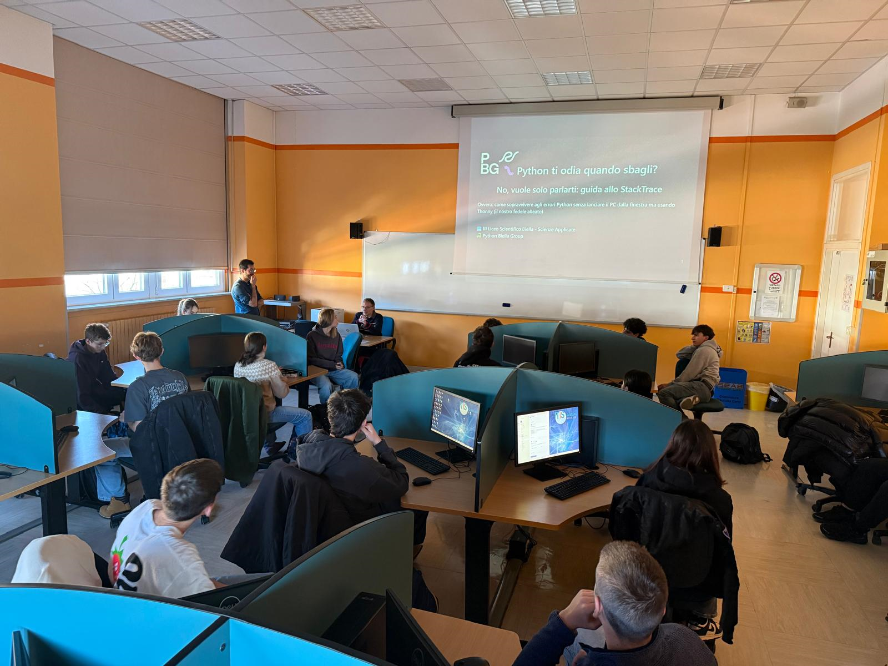

# Third Meeting

During the third meeting, two presentations were given:

1) **Does Python hate you when you make mistakes? No, it just wants to talk to you: a guide to stack traces**  
[https://github.com/PythonBiellaGroup/ProgettoScuole/blob/main/2025-26/03/01-teoria-stacktrace.pdf]

{ width="300" }

1) **PyGameZero: Stranger Stars – save your character**  
[https://github.com/PythonBiellaGroup/ProgettoScuole/blob/main/2025-26/03/03-pratica-stranger-stars.pdf]

The students were also introduced to this simple game, **“Stranger Stars”**:  
[https://github.com/PythonBiellaGroup/LearningPythonWithGames/tree/main/game04_1]

Since the first part of the meeting focused on how to read and understand Python errors, the version of the game provided to the students intentionally contained bugs. Their task was to fix them in order to arrive at a fully working version.
