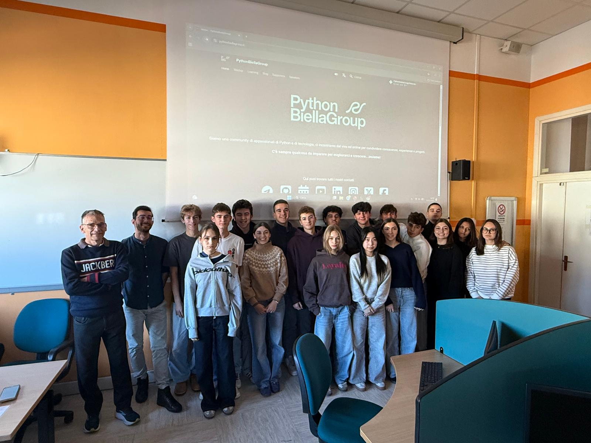

# Progetto Scuole 2025-2026

Ad ottobre 2025 siamo partiti, in collaborazione con il professor Roberto Borchia e la sua classe III LICEO SCIENTIFICO di Biella opzione SCIENZE APPLICATE con insegnamenti integrativi "Scienza dei dati e Intelligenza Artificiale" (ore aggiuntive di Informatica e Matematica).
Questa classe sta studiando Python da circa un anno, utilizza Thonny come IDE.

{ width="300" }

Con il professore abbiamo definito un calendario di incontro che prevede un incontro mensile di due ore, ciascuno diviso in una parte teorica e in una parte più pratica.

Sebbene il materiale preparato sia stato focalizzato alla situazione e al programma della classe, riteniamo possa essere riutilizzato e facilmente adattabile in altri contesti.

Tutto il materiale è rilasciato in modalità open source sul progetto GitHub:
<https://github.com/PythonBiellaGroup/ProgettoScuole/tree/main/2025-26>

Lasciando i dettagli di ciascun incontro in cartelle specifiche, specifichiamo che la parte pratica dei primi tre incontri è stata orientata al risveglio della passione e della creatività nella programmazione attraverso lo sviluppo di semplici giochi con PyGameZero.

Non ci siamo limitati a "riciclare" giochi già realizzati nel "percorso" già esistente ma abbiamo attualizzato il percorso con nuovi giochi, accompagnati da una parte teorica completamente rinnovata.
