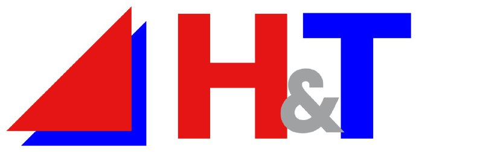
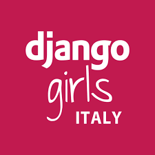

# Supporters

**PythonBiellaGroup** is a highly active community throughout the Italian territory, and in this section, we want to thank all the friends who support us and whom we support, with whom we have the pleasure of sharing interests, initiatives, and activities.

### 🐍 **Python Italia**

[Python Italia](http://www.python.it/) is the most important community in Italy when it comes to the **Python** programming language.
 Every year, they organize [Pycon](https://pycon.it/en), the most significant international event that allows enthusiasts from all over the world to come together.

Of course, the PythonBiellaGroup community always participates. Will we see you there? 😎

---
### 💻 **H&T**

[H&T](https://het.it/) is a company specialized in finding IT solutions for every type of need: apps, websites, e-commerce, custom software development, and on-site consulting.

---

### 🐉 **Python Milano**

[Python Milano](https://milano.python.it/) is the top-notch community in Milan for Python enthusiasts. In addition to the meetings and events offered by the community, we also highlight [Intervista Pythonista](https://intervistapythonista.com/), a podcast that gives a voice to all italian pythonistas. You can find it on all platforms!

---

### 🎒 **TheRedCode**

[TheRedCode](https://www.theredcode.it) of [Serena Sensini](https://www.linkedin.com/in/serena-sensini/?originalSubdomain=it)
is now a must-read for everyone who wants to find tutorials, guides, and interesting articles on the latest tech trends. **Give it a visit if you haven't already!**

---
### 👩 **Django Girls**

[Django Girls](https://www.fuzzybrains.org/) is a community born in Berlin in 2014, founded by female developers with the support of the Django community. Django Girls' mission is to introduce more diversity into the programming world, primarily through their fantastic workshops.

You can also find them at [Pycon](https://djangogirls.org/en/pyconitalia/)

---
### 🌐 **Clearbox AI**

[Clearbox AI](https://www.clearbox.ai/) is a company based in Turin whose core business is the generation of synthetic data for various industries. One of the founders is [Luca Gilli](https://www.linkedin.com/in/luca-gilli/?originalSubdomain=it), a highly active member of our community, who has become a regular presence at our meetups both as an attendee and as a speaker.

---

### 🌌 **SellaLab**

[SellaLab](https://sellalab.com/) is an innovation platform, born within the Sella Group, aimed at startups and businesses with the goal of supporting their growth, open innovation processes, and digital transformation. We often organize events together with them in their beautiful spaces.

One of the most important ones is undoubtedly the **BiDigital**. Don't miss it!

---

### 👾 **Genropy**

[Genropy](https://www.genropy.org/) defines a new and original programming paradigm, allowing you to create desktop-like applications in extremely fast times through an integrated solution, from GUI to ORM to deployment. This way, all the necessary tools to create and manage a web app are provided in a simple manner, without the need to know the specific implementation details of the database used (sqlite, postgres, mysql, microsoft sql, and oracle).
The framework is aimed at people who develop and want to create web applications, programming in Python on the server-side and using its syntax on the client-side. This approach enables the rapid creation of user interfaces with minimal use of HTML, CSS, and Javascript.

The Genropy guys are also very active members of the community! Hurry and take a look at their talks on our channel. [Youtube](https://www.youtube.com/watch?v=41M-UL3lZs4&list=PLyaoAB2kb_ZHZbEblU86R6Vttwl-Cplr2&pp=iAQB)